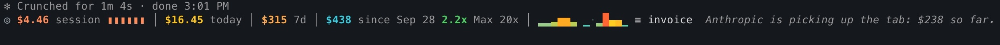
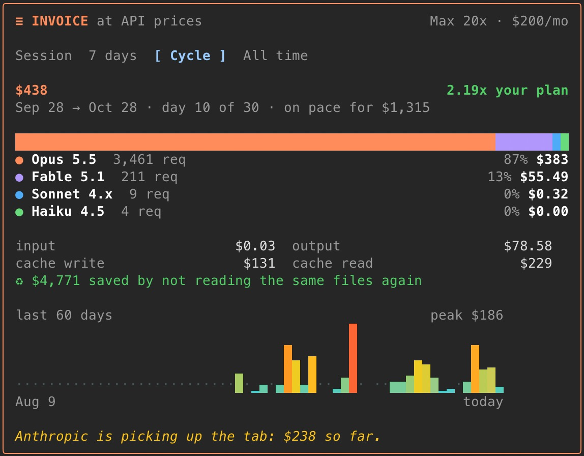
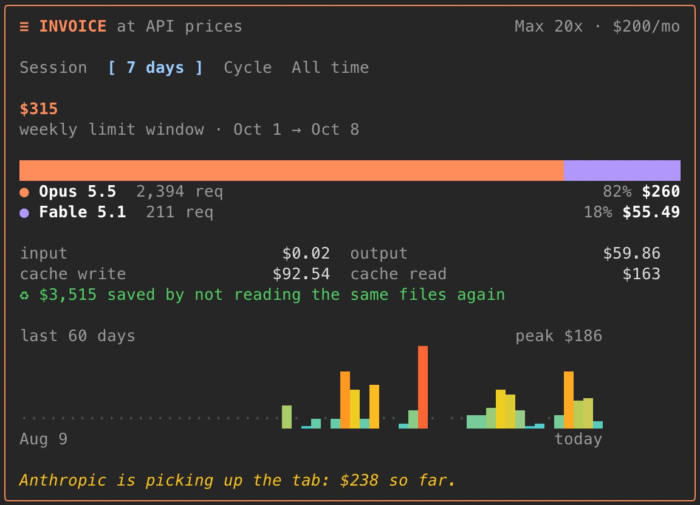

# what-would-it-cost

**A Claude Code cost tracker: what your Pro or Max subscription would cost at API prices, live above your prompt.**



One line, always on, updated after every model request while Claude works:

| | |
|---|---|
| **◉ $4.46 5h** | your current 5-hour limit window at API prices, across every Claude Code session. The dot turns orange while Claude is working |
| **▮▮▮▮▮▮** | that window's model mix: orange Opus, purple Fable, blue Sonnet, green Haiku |
| **$16.45 today** | every Claude Code session on this machine today |
| **$315 7d** | your current weekly limit window, from Claude Code's own reset time |
| **$438 since Sep 28** | your billing cycle so far, from the day your plan renews |
| **2.2x Max 20x** | how many times over the cycle has paid for your plan |
| **▂▅█▃▁▆** | the last 14 days, colored from quiet to busy |
| *Anthropic is picking up the tab…* | a running commentary, with a new line every ten minutes |

It reads your history on install, so the numbers start with your past month instead of $0.

## The invoice

Click **≡ invoice** on the bar for the full bill. Tabs switch it between your **5-hour** limit window, your **7-day** limit window, your **billing cycle** and **all time**, each broken down by model and token type, with a 60-day chart.

<p>
  
  
</p>

## Install

In a Claude Code terminal session:

```
/plugin install what-would-it-cost --marketplace Faouzielbakri/what-would-it-cost
```

Answer `y` to add the marketplace, then pick the **user** scope so it runs in every session. On first run it prices every transcript already on your disk (`~/.claude/projects`) and tells you the total when it's done.

## What it counts

- **Every model request**, subagents included, priced at Anthropic's list prices per model: input, output, cache reads and cache writes.
- **Your history** from Claude Code's own transcripts, so nothing is counted twice and nothing needs to be running in the background.
- **Prompt caching savings**: what the cache reads would have cost as fresh input.
- **Every session on this machine**: open Claude Code in five projects and they all add to the same numbers, updated every 30 seconds.

## Privacy and permissions

Everything stays on your machine.

**What it sends: nothing.** It makes no network requests and has no telemetry. The numbers are kept in Claude Code's own plugin storage as per-day token totals per model.

**What it reads:**

| What | Why |
|---|---|
| Claude Code's transcripts in `~/.claude/projects` (or `$CLAUDE_CONFIG_DIR/projects`) | To price your history on first run. It keeps only each response's model, timestamp and token counts; message text is never stored. |
| `~/.claude.json`, two fields only: `oauthAccount.*RateLimitTier` and `oauthAccount.subscriptionCreatedAt` | To know your plan (Pro, Max 5x, Max 20x) and the day it renews. Skipped entirely when you set **Your plan** and **Billing day** yourself in `/config`. |
| The `HOME` and `CLAUDE_CONFIG_DIR` environment variables | To find the two locations above. |
| Claude Code's own usage figures | For the reset times of your 5-hour and weekly limit windows. |

**Programs it runs:**

| Command | When and why |
|---|---|
| `dd if=<transcript> bs=1048576 skip=<n> count=3` | Only for transcripts over 4 MB, which is the most a mod can read in one go. It reads them in 3 MB chunks, read-only. |
| `claude auth status` | Only when the plan can't be read from `~/.claude.json`, to tell Pro, Max and API-key accounts apart. |

## Your plan

It reads your exact plan (Pro, Max 5x or Max 20x) from the rate-limit tier in Claude Code's own config (`~/.claude.json`), falling back to `claude auth status`. To set it yourself, go to `/config` → **what-would-it-cost › Your plan** and pick `pro`, `max-5x`, `max-20x` or `api`.

The multiplier runs over your **billing cycle**, not the calendar month: if you subscribed on the 15th, the cycle runs from the 15th to the 15th. The renewal day is read from when your subscription began; set **Billing day** in `/config` if yours differs (say, after a plan change).

If you're on an API key, the bill is real money. The band shows anyway.

## Prices

List prices per million tokens, from [Anthropic's pricing page](https://platform.claude.com/docs/en/about-claude/pricing) (October 2026):

| Model | Input | Output | Cache read | Cache write (5m / 1h) |
|---|---|---|---|---|
| Fable 5.1 | $10 | $50 | $0.25 | $12.50 / $20 |
| Fable 5 | $10 | $50 | $1.00 | $12.50 / $20 |
| Opus 5.5 | $4 | $20 | $0.20 | $5 / $8 |
| Opus 5 / 4.5–4.8 | $5 | $25 | $0.50 | $6.25 / $10 |
| Sonnet 5 / 5.5 | $2 | $10 | $0.20 | $2.50 / $4 |
| Sonnet 4.x | $3 | $15 | $0.30 | $3.75 / $6 |
| Haiku 4.5 | $1 | $5 | $0.10 | $1.25 / $2 |

Caveats:

- History is priced exactly, cache writes split into 5-minute (1.25x input) and 1-hour (2x) as each transcript records them. Live usage doesn't carry that split, so live writes count as 1-hour, which is what Claude Code uses.
- Claude Code deletes transcripts after 30 days by default (`cleanupPeriodDays`), so history only goes back as far as your transcripts do.
- Fast mode isn't detected and is priced as standard.
- A model id the table doesn't know is priced as Opus 5.5 and marked with `?`. PRs that add new models to [`hooks/pricing.ts`](hooks/pricing.ts) are welcome.
- Days are counted in your local time zone.

## Develop

```
claude --plugin-dir ./what-would-it-cost     # run it from a checkout; saving a file hot-reloads it
claude plugin validate ./what-would-it-cost
claude plugin test ./what-would-it-cost
```

## License

MIT. Fork it, remix it, ship it. If you build on it, a link back to [Faouzi El Bakri](https://github.com/Faouzielbakri) is appreciated.
